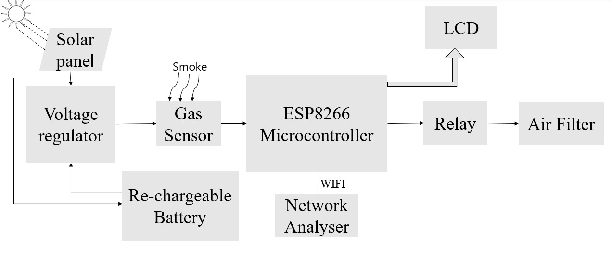
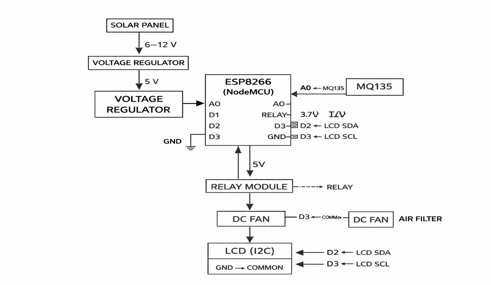
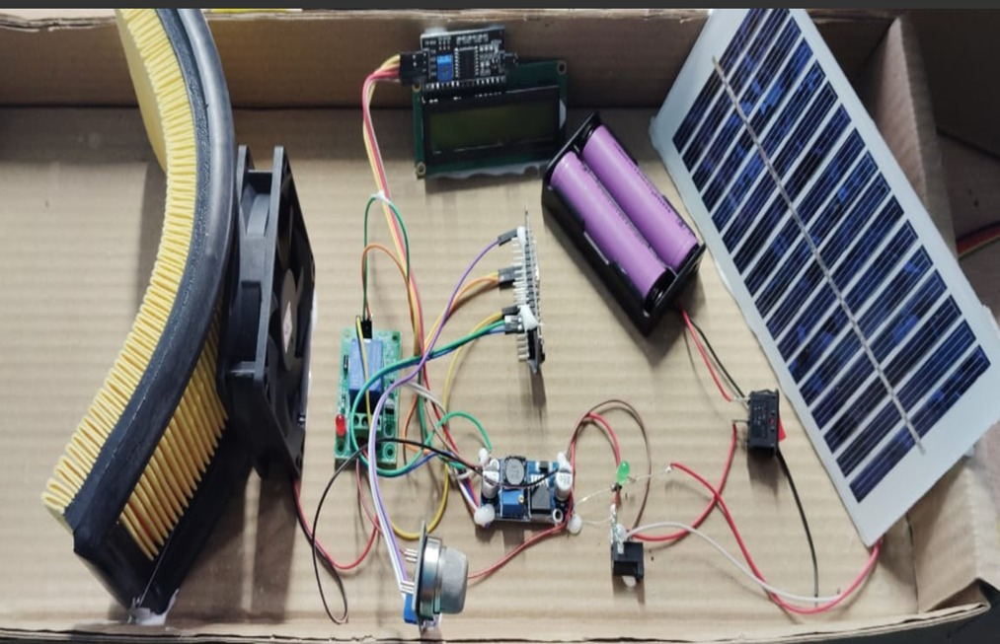
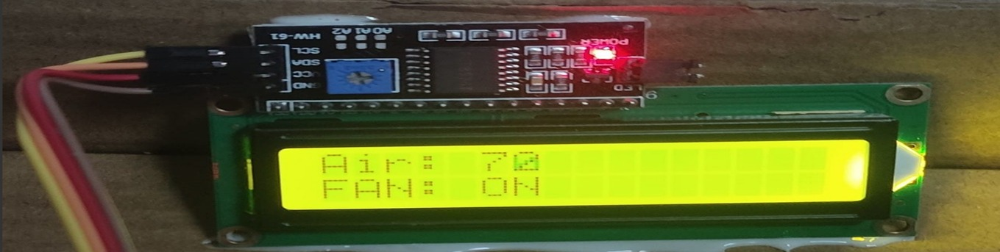
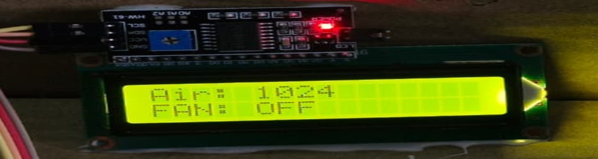

# ambient-air-monitoring-and-purification-using-solar
Developed a solar-powered system for monitoring ambient air quality and performing air purification based on pollution  in  surrounding Air. The project integrates environmental sensing, embedded systems, and renewable energy concepts as part of an academic project.

##About This Project
This project focuses on monitoring ambient air quality and performing air purification using a solar-powered system. The objective of the project is to continuously monitor air pollution levels and activate a purification mechanism when the pollution is less than a predefined threshold of AQI data. The system uses air quality sensors to detect pollution levels in the surrounding environment. A microcontroller(ESP 8266) processes the sensor data and controls the purification unit such as a fan or filter. Solar energy is used as the primary power source, making the system energy-efficient and suitable for outdoor applications. This project was developed as an academic project to study environmental monitoring, embedded systems, and renewable energy integration.

## Components Used
 Gas sensor(MQ135)
 Microcontroller(ESP 8266)
 Solar panel(12V)
 Battery and charge controller
 Relay module
 Air purification unit (fan / filter)

## System Block Diagram

##System Interface Diagram

##Hardware Setup

## Working Principle
The air quality sensor continuously monitors the surrounding air. When the pollution level is less than a set threshold of AQI data, the microcontroller activates the relay to turn ON the purification unit. When the air quality returns to normal, the purification unit is turned OFF automatically. The system operates using power generated from a solar panel and stored in a battery.

##Results

## Applications
- Environmental monitoring
- Pollution control systems
- Smart cities
- Solar-powered monitoring systems
